<!DOCTYPE html>
<html>
<head>
    <meta charset="UTF-8">
    <title>土力学</title>
    <!-- 引入MathJax公式渲染 -->
    
    
    
</head>
<body>

# 土力学笔记

用于方便自己学习，顺便熟练一下公式语法，结合书本使用最佳

<!-- TOC START (不要删除此行) -->
## 目录
- [土力学笔记](#土力学笔记)
  - [目录](#目录)
  - [一  绪论](#一--绪论)
  - [二  土的物理性质与工程分类](#二--土的物理性质与工程分类)
  - [三  土的渗透性与渗流](#三--土的渗透性与渗流)
  - [四  地基中应力与计算](#四--地基中应力与计算)
  - [五  土的压缩性和固结理论](#五--土的压缩性和固结理论)
  - [六  地基沉降计算](#六--地基沉降计算)
  - [七  土的抗剪强度理论](#七--土的抗剪强度理论)
  - [八  土压力和支挡结构](#八--土压力和支挡结构)
  - [九  地基承载力](#九--地基承载力)
  - [十  土坡稳定分析](#十--土坡稳定分析)
<!-- TOC END (不要删除此行) -->

---

## 一  绪论
土力学的**研究对象**是土
 
土的**工程性质**与==母岩成分、风化作用性质、搬运沉积环境、沉积年代==有关
 
土的**组成**：==固相、气相、液相==
 
土的**性质**：==区域性强、不均匀性强、多相性、结构性强==
 
土力学的**研究问题**：==稳定问题、变形问题、渗流问题==

---
## 二  土的物理性质与工程分类
核心要点：土力学的基本概念
 

- 外力地质作用：==风化、剥蚀、搬运、沉积==，对土的生成最重要的是==风化==
  - 风化有：物理风化、化学风化、生物活动

 

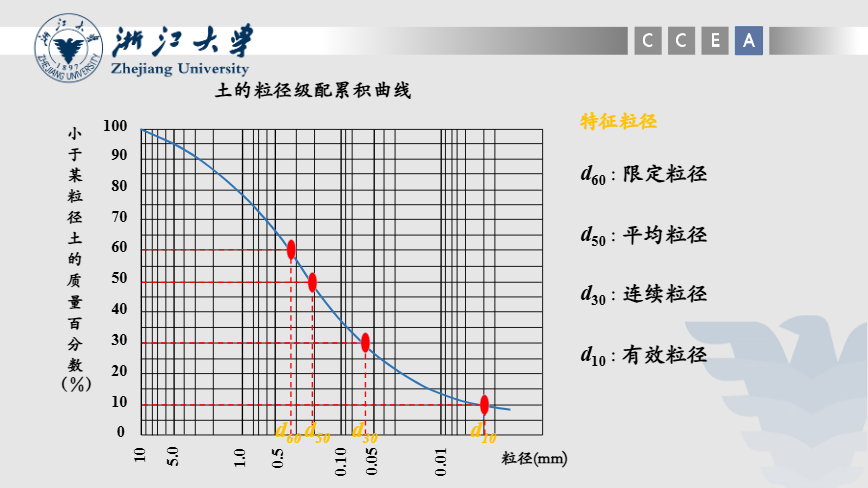
- 土固体颗粒三要素：==粒径级配、矿物成分、颗粒形状==
- 土固体颗粒中的**粒径级配**:
  - 土的**粗细度**：用 $d_{50}$ 表示
  - 土的**不均匀系数**：$$C_u=d_{60}/d_{10}$$
  $\;\;\;\;\;\;\;\;\;\;\;\;\;\;\;\;\;\;\;\;\;\;\;\;C_u\geqslant5$ 为不均匀土，反之均匀土
  - 土的**连续程度**：$$曲率系数：C_c=\frac{d_{30}^{2}}{d_{60}\cdot d_{10}}$$
  $\;\;\;\;\;\;\;\;\;\;\;\;\;\;\;\;\;\;\;\;\;\;\;\;C_c$=1~3 为级配连续
- 土固体颗粒中的**矿物成分**:
  - **原生矿物**：==石英、长石、云母==
  - **次生矿物**：==粘土矿物、==
 
$\;\;\;\;\;\;\;\;\;\;\;\;\;\;\;$==无定形氧化物胶体（$Al_{2}O_{3}、Fe_{2}O_{3}$）、==
 
$\;\;\;\;\;\;\;\;\;\;\;\;\;\;\;$==可溶盐（$CaCO_{3}、CaSO_{4}、NaCl$等）==
 

**粘土矿物**主要由**硅氧晶片**和**铝氢氧晶片**构成，组成==蒙脱石、伊利石、高岭石==，亲水性由**高->低**
 
**粘土矿物**有带电性，带负电的（*离解、吸附作用、同象置换*）粘土颗粒向阳极移动称为==电泳==，水化的阳离子向负极移动称为==电渗==
 

- 土固体颗粒中的**有机质**：
  - 未分解的动植物残体
  - 半分解的泥炭
  - 完全分解的腐殖质（以这个为主）
- **液相**
  - 矿物内部结合水（*不算到含水量中*）
  - 结合水（吸附水）：受电分子吸引力吸附于土粒表面的土中水
    - 强结合水：
    - 弱结合水：
  - 自由水：存在于土粒表面电场影响以外的水
    - 重力水：
    - 毛细水：

 

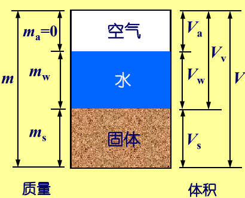
- 土的**物理性质指标**：土中三相**体积、重量、比例关系方面的一些物理量**
  - 实验测定的：
    - 含水量 $\;w=\frac{m_w}{m_s}\times100\%$
    - 密度 $\;\rho=\frac{m}{V}=\frac{m_s+m_w}{V}$
    - 土粒比重（相对密度） $\;d_s=\frac{m_s}{V_s}\cdot\frac{1}{\rho_{w1}}=\frac{\rho_{s}}{\rho_{w1}}$ 
  - 实验测定的指标换算的：
    - 孔隙比 $\;e=\frac{V_v}{V_s}$
    - 孔隙率 $\;n=\frac{V_v}{V}\times100\%$
   ==注意$n=\frac{e}{1+e},\;e=\frac{n}{1-n}$==
    - 饱和度 $\;S_r=\frac{V_w}{V_v}\times100\%$
  - 其他可换算的：
    - 干密度 $\;\rho_d=\frac{m_s}{V}$
    - 饱和密度 $\;\rho_{sat}=\frac{m_s+\rho_wV_v}{V}$
    - 有效密度 $\;\rho'=\frac{m_s-\rho_wV_s}{V}$
   ==注意$\rho_{sat}>\rho>\rho_d>\rho'$==

 

- **无黏性土**的物理性质一般指**松密程度**，用==密实度==表示，评价指标：
  - ==孔隙比 $\;e$==
  - ==相对密实度 $\;D_r=\frac{e_{max}-e}{e_{max}-e_{min}}$==
 
由于孔隙比测量不准，所以用相对密实度计算不准，因此一般采用**标准贯入锤击数**来划分密实度；也可用**野外鉴别法**划分

 

- **黏性土**的物理性质一般指**软硬状态**，用==稠度==表示
  - 随着**含水量**增加，分为==固态、半固态、可塑状态、流动状态==
  - 由一种状态转入另一种状态的含水量称为**界限含水量**(有百分号)，从大->小有
     ==缩限 $\;W_S$==，体积不再随含水量降低而缩小
     ==塑限 $\;W_P$==，由半固态转为可塑状态，出现弱结合水
     ==液限 $\;W_L$==，由可塑状态转为流动状态，出现自由水
  - ==塑性指数 $\;I_p=W_L-W_P$==，液限和塑限的差值（省略百分号），反应了
    - 土的**颗粒成分**
    - 土粒**矿物组成**
    - 土中**水的离子成分和浓度**
  - ==液性指数 $\;I_L=\frac{W-W_P}{W_L-W_P}$==，天然含水量和塑限的差值与塑性指数之比，反映了
    - 土的**软硬程度**,分为
     **坚硬、硬塑、可塑、软塑、流塑**

 

- 土的**结构**，由==大小、形状、相互排列、联结关系==形成的综合特征
  - **单粒结构**：砂土、碎石土构成，有疏松型、紧密型
  - **蜂窝结构**：粒径$0.075-0.005mm$的土粒沉积时形成
  - **絮状结构**：粒径$<0.005mm$的黏粒，
     淡水中沉积，粒间斥力充分发挥，分散型结构
     海水中沉积，减少颗粒间排斥力，絮状结构
- 土的**构造**，==相近物质成分、颗粒大小的土层、空间的相互关系特征==
  - **成层性**：层理构造
     水平层理构造、交错层理构造
  - **裂隙性**：如黄土柱状裂隙
  - **不均匀性**：腐殖质、贝壳、结核体
 

反应**黏性土结构性**的重要特性：灵敏度、触变性
 灵敏度 $\;S_t=q_u/q_{u}^{'}$：原状土的（无侧限抗压）强度与重塑后的强度之比
 触变性：饱和黏性土受扰动后强度降低，后随时间恢复的特性

 

土的**压实性**：外部压实作用克服粒间阻力产生位移，使得==孔隙减小、密度增加、强度提高==

**压实度** $D_c=\frac{\rho_d}{\rho_{dmax}}$

**夯击**——细粒土 **振动**——粗粒土 **碾压**

对于同一种土,最优含水量和最大干密度并不恒定,而随压密功能变化，压实功能愈大,最优含水量愈小，相应的最大干密度愈高

超过最优含水量后，压实功能的影响随含水量的增加逐渐减小。击实曲线均靠近于饱和曲线
 
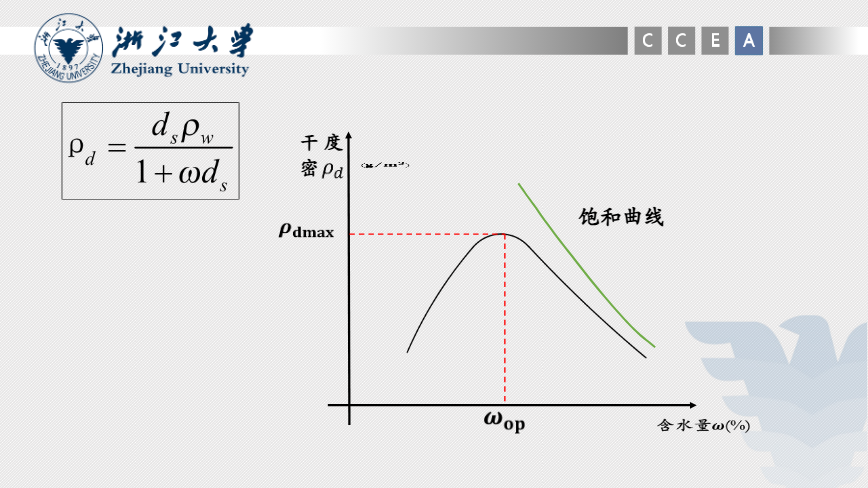

- 土的**工程分类**：三个分类原则
  - **工程特性差异**的原则
    - 土的主要工程特性
    - 影响土的工程特性的主要因素
    - 有一定质或显著量的区别
  - **成因、地质年代为基础**的原则
    - 土是自然历史的产物
    - 成因与形成年代控制
    - 不同成因、年代的土
  - **分类指标易测定**的原则
    - 反应土的主要工程性质
    - 测定方法简便
- 土的**工程分类体系**：两种
  - **建筑工程系统**的分类体系
    - 土为建筑地基和环境
    - 以原状土为基本对象
    - 注重土的天然结构性
  - **材料系统**的分类体系
    - 把土作为建筑材料
    - 扰动土为基本对象
    - 以土的组成为主
    - 不考虑土的天然结构性

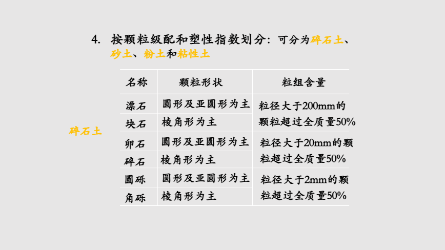
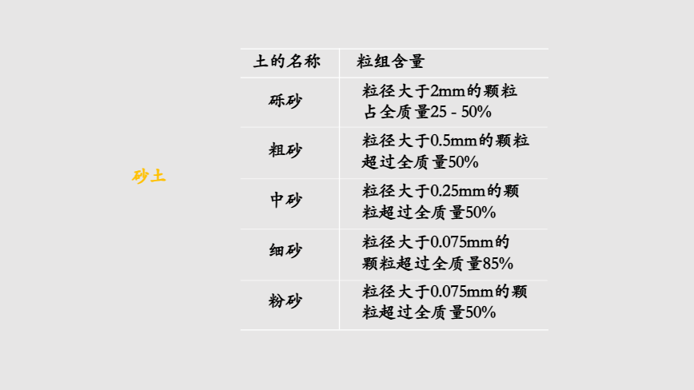
- **碎石土**：粒径大于 $2mm$ 的颗粒含量大于全重 $50$% 的土
- **沙土**：粒径大于 $2mm$ 的颗粒含量小于全重 $50$%， 且粒径大于 $0.075mm$ 的颗粒含量大于全重 $50$% 的土
- **粉土**：粒径大于 $0.075mm$ 的颗粒含量小于全重 $50$% ， 且塑性指数 $I_p\leqslant10$ 的土
- **黏性土**：塑性指数大于 $10$ 的土
  - **粉质黏土**： $10<I_p\leqslant17$ 
  - **黏土**： $I_p>17$ 
 

---
## 三  土的渗透性与渗流
核心要点：达西定律＆有效应力原理

水在土体孔隙中流动的现象称为**渗流**
 
总水头 $h=z+\frac{u}{\gamma_w}+\frac{v^2}{2g}$
 位置水头 $z$、压力水头 $\frac{u}{\gamma_w}$、测管水头 $\frac{v^2}{2g}$ 测管水头 $z+\frac{u}{\gamma_w}$

**水力坡降 $\;i$**：单位渗流长度上的水头损失 $i=\frac{\Delta h}{L}$
 
**渗流问题**：==渗流量、渗透破坏、渗透力==

**达西定律**（适用于层流）：$$Q=kAi=k\frac{\Delta h}{L}A$$
**渗透系数 $\;k$**, 单位 $\;m/s$
 
由土的性质决定：==孔隙比、颗粒大小与级配、饱和度、矿物成分与结构==

- **孔隙比**：e越大，k越大
- **颗粒大小与级配**：土体孔隙大小一般由细颗粒控制，常用有效粒径来表示，比如哈臣公式 $k=c\cdot d_{10}^2$
- **饱和度**：$S_r$越大，k越大
- **矿物成分与结构**：可交换钠离子越多时渗透性越低

$k$ 由水头实验确定：常水头实验适用于粗粒土；细水头实验适用于细粒土；抽水试验适用于现场试验
 

- 层状地基等效渗透系数计算：
  - 水平等效渗透系数：$$k_H=\frac{\Sigma_{i=1}^{n}H_ik_i}{\Sigma_{i=1}^{n}H_i}$$
  - 垂直等效渗透系数：$$k_V=\frac{\Sigma_{i=1}^{n}H_i}{\Sigma_{i=1}^{n}H_i/k_i}$$

**饱和土中的应力和有效应力原理**：描述骨架和孔隙流体的应力分布，分为==粒间应力==和==孔隙水压力==$$\sigma=\sigma'+u$$
有效应力是土体发生变形的原因，是土体强度的成因

**渗透力 $j$**：渗透作用中，孔隙水对土骨架的作用力，方向与渗流方向一致
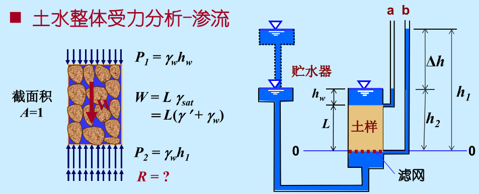
在静水中底部支持力 $R=\gamma'L$ 
在渗流中底部支持力 $R=\gamma'L-\gamma_w\Delta h$
 减少的支持力由**总渗流力** $J=\gamma_w\Delta h$提供
 **渗透力 $j$**：单位体积土体内土骨架所受到的渗透水流的推动和拖曳力$$j=\frac{J}{V}=\frac{\gamma_w\Delta h}{L}=\gamma_w i$$
**临界水力坡降**为支持力等于零时的水力坡降：$$i_{cr}=\frac{\delta h}{L}=\frac{\gamma'}{\gamma_w}=\frac{d_s-1}{1+e}$$

- **渗透变形**
  - **流土**：在向上的渗透作用下，表层局部范围内的土体或颗粒群同时发生悬浮、移动的现象。任何类型的土，只要水力坡降达到一定的大小，都可发生流土破坏。 ==原因：$i=i_{cr}$==
  - **管涌**：在渗流作用下，一定级配的无黏性土中的细小颗粒，通过较大颗粒所形成的孔隙发生移动，最终在土中形成与地表贯通的管道。 ==内因：有足够多的粗颗粒形成大于细粒直径的孔隙 外因：渗透力足够大==

---
## 四  地基中应力与计算
核心要点：布辛涅斯克解及其应用

==地基中自重应力、基底压力、基底附加压力、附加应力==

地基中的应力同弹性力学相同，但正负号相反 (注意：仅应力计算采用)
- 应力计算中对土的**基本假定**
  - **碎散体**：连续介质（宏观平均）
  - **非线性弹塑性**：线弹性体（应力较小时）
  - **成层土各向同性**：均质各向同性体（土层性质变化不大）

 

- 土的**自重应力**
 竖直向总应力：单位面积上土柱和水柱总重量 ==$\sigma_{zx}=\Sigma\gamma_iH_i$==
 非饱和土用**天然容重** $\gamma$
 饱和土用**饱和容重** $\gamma_{sat}$
 纯水部分用**水的容重** $\gamma_{w}$
- **孔隙水压力**：根据实际地下水条件，区分**静水条件**和**稳定渗流条件**等情况进行计算

**竖直向有效应力**根据 $\sigma=\sigma'+u$ 计算 
**水平向自重应力**根据 $\sigma_{sx}=\sigma_{sy}=K_0\sigma_{sz}$ 
&emsp;&emsp;其中 $K_0=\frac{\nu}{1-\nu}$，为静止土压力系数，一般表示有效竖向与横向自重应力间的关系
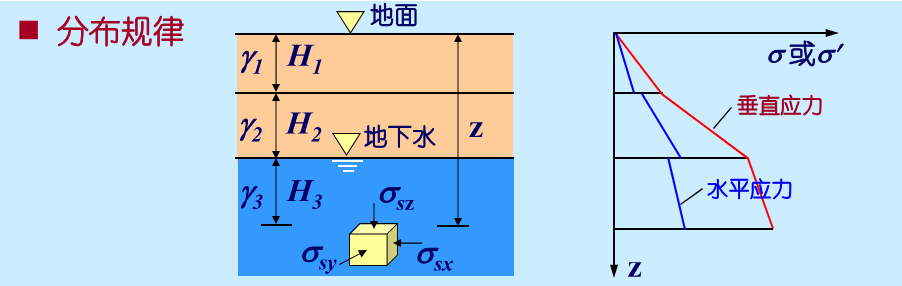

**基底压力**：基础底面传递给地基表面的压力，也称基底接触压力。
基底压力既是计算地基中附加应力的外荷载，也是计算基础结构内力的外荷载 

**矩形基础**：为了简化计算，用假定基底压力按直线分布的材料力学方法
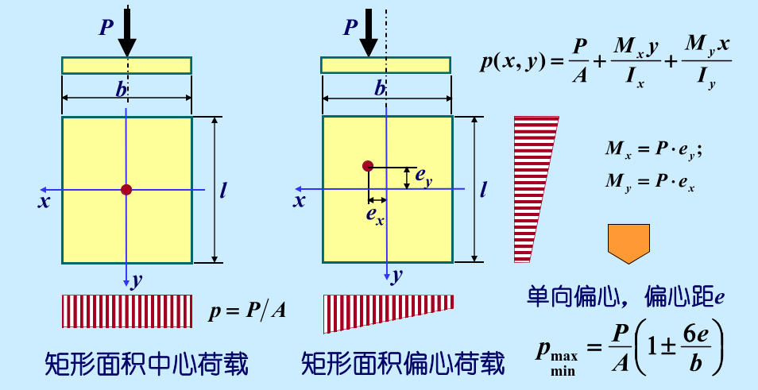
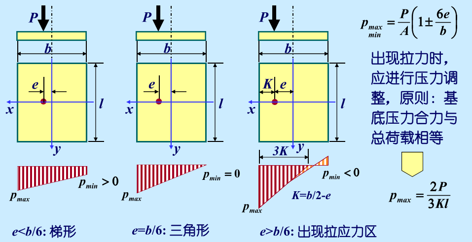

**基底附加压力**：是指作用在基础底面的压力与基础底面处原有的自重应力之差。它是引起地基土附加应力及变形的直接因素

**附加应力**：是由于修建建筑物之后在地基内新增加的应力，它是使地基发生变形而引起沉降的主要原因。==满足叠加原理==，可对各种特殊荷载和面积进行分解和组合，利用已知解求解
 **地表竖直集中力
Boussinesq 解**：其中竖直应力
$$\sigma_z=\frac{3P}{2\pi}\frac{z^3}{R^5}=\frac{3}{2\pi}\frac{1}{[1+(r/z)^2]^{5/2}}\frac{P}{z^2}=\alpha\frac{P}{z^2}$$
条形面积竖直均布荷载，附加应力系数$K_z,K_x,K_{xz}$查表得 **(l/b>10的矩形中部可认为是条形)** 
矩形面积竖直均布荷载，中心点下的附加应力系数$K_{z0}$查表得，角点下的附加应力系数$K_{z1}$查表得 

**角点法**：某点处的应力等于其在四个相邻矩形角点上的应力值之和

上层软，下层硬：==应力集中== 
上层硬，下层软：==应力扩散==

---
## 五  土的压缩性和固结理论
核心要点：压缩性指标＆一维固结理论

在压力作用下，土骨架将随着孔隙中水和气的压缩和排出而发生变形，土体体积将缩小，土的这种特性称为==土的压缩性==。土在压力作用下的压缩是随时间逐步发展并逐渐完成的，这一现象或过程就称为==土的固结==。

- 认为土的压缩是土中**孔隙体积的减小**
  - 对**非饱和土**：土的压缩就是土中部分孔隙气的**压缩**以及部分孔隙水和气的**排出**。
  - 对于**饱和土**：土的压缩就是土中部分孔隙水的**排出**。

- 土的==压缩性指标==：
  - 压缩系数 $a$
  - 压缩指数 $C_c$
  - 压缩模量 $E_s$
  - 变形模量 $E_0$

压缩试验中 $e-\Delta H$ 关系：$e_2=e_1-(1+e_1)\frac{\Delta H}{H_1}$ 
土的**压缩曲线**是土的==孔隙比与有效应力==的关系曲线

 

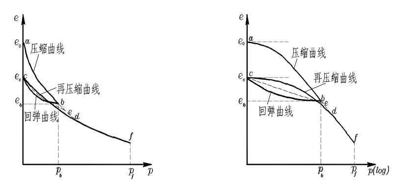

**压缩系数**$$a=-\frac{de}{dp}$$$$a=-\frac{\Delta e}{\Delta p}$$
a越大，土的压缩性越大，同种土的压缩系数a不是常数，与应力 p 有关。==常用 $a_{1-2}$ 即应力范围为100-200 kPa的a值对不同土的压缩性进行比较== 
$a\geqslant0.5$:高压缩性土 
$a\leqslant0.1$:低压缩性土

**压缩指数**$$C_c=-\frac{\Delta e}{\Delta(\lg p)}$$
在压力较大部分，$e-\lg p$曲线接近直线段，反映了土的应力历史 
回弹指数（再压缩指数）$C_e$远小于$C_c$，一般是其0.1-0.2倍 
$C_c$越大，土的压缩性越大。 
压缩系数与压缩指数区别在于：==$a$是变数且有量纲，$C_c$是无量纲常数== 
$C_c>0.4$:高压缩性土 
$C_c<0.2$:低压缩性土

**侧限压缩（变形）模量**$$E_s=\frac{\Delta p}{\Delta {\epsilon}}$$
初始加载$E_s$，卸载和重加载$E_e$，因为 $\Delta\epsilon=-\frac{\Delta e}{1+e_0}$，故$$E_s=\frac{\Delta p}{\Delta {\epsilon}}=\frac{1+e_0}{a}$$
$E_s$越小，土的压缩性越大。
 
**体积压缩系数**$$m_v=\frac{1}{E_s}$$

 

**变形模量**：土在无侧限条件下的竖向应力增量与相应竖向应变增量之比
$$E_0=\frac{\Delta\sigma_z}{\Delta\epsilon_z}$$

 

==变形模量与侧限压缩模量关系：==
$$E_0=\frac{\Delta\sigma_z}{\Delta\epsilon_z}\cdot(1-\frac{2\mu^2}{1-\mu})=\beta E_s$$
$$E_0<E_s$$

**超固结比OCR**：先期固结压力与当前竖向压力之比：
$$OCR=\frac{p_c}{p_0}$$

---
**一维固结理论**基本假定：
1. 土体是均质且完全饱和的
2. 土颗粒与水不可压缩
3. 土体固结变形是微小的
4. 水的渗出和土层压缩只沿竖向发生
5. 渗流符合达西定律且渗透系数保持不变
6. 压缩系数a是常数
7. 荷载均布，瞬时施加，总应力不随时间变化

**Terzaghi一维渗流固结模型**
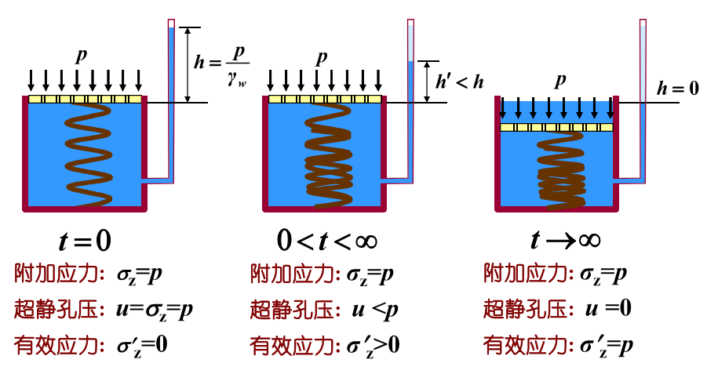
**土层超静孔压**是 z 和 t 的函数，渗流固结的过程取决于土层可压缩性（总排水量）和渗透性（渗透速度）
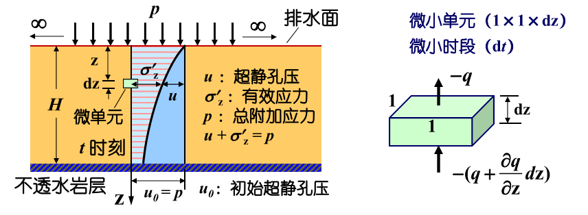
**渗透固结微分方程**：
$$\frac{\partial u}{\partial t}=C_v\frac{\partial u^2}{\partial z^2}$$
其中==固结系数 $C_v=\frac{k(1+e_1)}{a\gamma_w}=\frac{kE_s}{\gamma_w}$== 反映了超静孔压的消散速度与孔压沿竖向的分布有关 
反映土的固结特性：孔压消散的快慢－固结速度； 
与渗透系数 k 成正比，与压缩系数 a 成反比； 
单位：cm2/s；m2/year，粘性土一般在 10-4 cm2/s 量级 

**解的一般形式为**
$$u(z,t)=(C_1\cos Az+C_2\sin Az)e^{A^2C_vt}$$
由边值条件与初值条件得到
$$u=p_0\Sigma_{m=1}^{\infty}\frac{2}{M}\sin\frac{Mz}{H}e^{-M^2T_v},\;\;\;\;\;\;\;\;\;\;M=\frac{\pi}{2}(2m-1),\;\;\;T_v=\frac{C_v}{H^2}t$$
平均超静孔压
$$\bar u=p_0\Sigma_0^\infty\frac{2}{M^2}e^{-M^2T_v}$$
$T_v$ 为无量纲数，称为==时间因数==，反映超静孔压消散的程度也即固结的程度 
以上解是单面排水情况下得到的，但也适用于双面排水情况。对于双面排水情况，只需在式中将H代以H / 2即可。

 

**一点M的固结度 $U_{z,t}$**：有效应力与总应力之比，表征一点超静孔压的消散程度 
**一层土的平均固结度**：表征一层土超静孔压的消散程度
$$U_z=\frac{\int_{0}^{H}\sigma_{z,t}'dz}{\int_{0}^{H}\sigma_zdz}=1-\frac{\int_{0}^{H}u_{z,t}dz}{\int_{0}^{H}\sigma_zdz}$$
$U_z$ 是 $T_v$ 的单值函数，$T_v$ 可反映固结的程度
>$$U=\frac{S_{ct}}{S_{c\infty}}=1-\frac{\bar u}{p_0}=1-\Sigma_0^\infty\frac{2}{M^2}e^{-M^2T_v},\;\;\;\;\;其中S_{c\infty}=\int_{0}^{H_s}\frac{\sigma_z}{E_s}dz$$
>
>当$U\leqslant60\%,U=2\sqrt{T_v/\pi}$
>
>当$U\geqslant30\%,U=1-\frac{8}{\pi^2}e^{-\frac{\pi^2}{4}T_v}$
 

**总结**
土的==压缩性==和==渗透性==以及土层的==最大竖向排水距离==（或边界条件）是影响地基压缩和固结的关键因素。土的压缩性越低（即 $E_s$ 越大），渗透性越好（即 $k$ 越大），土层的最大竖向排水距离 $H$ （或土层的厚度）越小，则地基在同一时刻所达到的固结度越大，地基固结越快。$T_v$ 与 $H$ 的二次方成反比，故相对而言，土层的排水距离 $H$ 对地基固结的影响最大，缩短排水距离可极大地提高地基的固结速率。（排水固结法，砂井）

---
## 六  地基沉降计算
核心要点：分层总和法＆规范法计算沉降

**总沉降=初始沉降+固结沉降+次固结沉降(蠕变引起)**
$$s=s_d+s_c+s_s$$
对于砂土，初始与固结沉降在短时间内完成，次固结沉降很小，一般用弹性理论法计算
 
对于饱和软黏土，固结沉降持续时间长，占总沉降10%左右
***
**弹性理论法**
 将地基视作半无限各向同性弹性体，基底形状规则且基底压力均匀分布时：
$$s=\frac{pb}{E_0}(1-\mu^2)\cdot I_d$$
$p$ ——基底均布附加应力
 
$b$ ——矩形短边长，正方形边长，圆半径
 
$I_d$ ——沉降影响系数
***
**分层总和法**
 假定如下：
 （1）地基为半无限弹性体，附加应力按第四章计算
 （2）认为基底附加应力是作用于地表的局部荷载
 （3）土层压缩时不发生侧向变形
 （4）只计算竖向附加应力作用下产生的竖向压缩变形，不计剪应力的影响
$$s=\sum_{i=1}^{n}\Delta s_i=\sum_{i=1}^{n}\epsilon_i H_i=\sum_{i=1}^{n}\frac{e_{1i}-e_{2i}}{1+e_{1i}} H_i=\sum_{i=1}^{n}\frac{\Delta p_i}{E_{si}}H_i$$
 $e_{1i}$ ——自重应力平均值对应的孔隙比
 $e_{2i}$ ——自重应力平均值与附加应力平均值之和对应的孔隙比
 $\Delta p_i$ ——附加应力平均值
 注意自重应力在地下水位以下用有效重度计算

 对于**地基沉降计算深度 $z$** 要满足：==$\Delta \sigma_z \leqslant k\sigma_{cz}$==
 $\Delta \sigma_z$ ——深度 $z$ 处的附加应力
 $\sigma_{cz}$ ——深度 $z$ 处的自重应力
 $k$ ——通常可取 0.2
***
**建筑地基基础设计规范法**
 假设土体侧限条件下压缩模量不随深度变化，则基底至任意深度的压缩量为
$$s'=\int_{0}^{z}\epsilon_zdz=\frac{\int_{0}^{z}\sigma_zdz}{E}=\frac{A}{E_s}=\frac{p_0\int_{0}^{z}Kdz}{E_s}=\frac{p_0 z \bar\alpha}{E_s}$$
$$\Delta s'_i=\frac{p_0}{E_{si}}(z_i\bar\alpha_i-z_{i-1}\bar\alpha_{i-1})$$
$\bar\alpha$ ——平均附加应力系数（查表得）

==分层计算后得总沉降量：==
$$s=\psi_s\sum_{i=1}^{n}\frac{p_0}{E_{si}}(z_i\bar\alpha_i-z_{i-1}\bar\alpha_{i-1})$$
$\psi_s$ ——沉降计算经验系数（查表得）
 压缩模量当量值 ==$\bar E_s=\frac{p_0z_n\bar\alpha_n}{s'}$==

 对于**地基沉降计算深度 $z$** 要满足：==$\Delta s'_n \leqslant 0.025\sum_{i=1}^{n}\Delta s'_i$==,做复核用的计算厚度 $\Delta z$ 也是查表得

---
## 七  土的抗剪强度理论
核心要点：摩尔-库伦强度理论

**抗剪强度**：
$$总应力表达：\tau_f=c+\sigma\tan\phi$$
$$有效应力表达：\tau'_f=c'+\sigma'\tan\phi'$$
**极限平衡状态下最大主应力与最小主应力的关系**：
$$\sigma_1=\sigma_3\tan^2(45°+\frac{\phi}{2})+2c\cdot\tan(45°+\frac{\phi}{2})$$
$$\sigma_3=\sigma_1\tan^2(45°-\frac{\phi}{2})-2c\cdot\tan(45°-\frac{\phi}{2})$$
- **直接剪切试验**
  - 快剪试验
  - 固结快剪试验
  - 慢剪试验
- **常规三轴压缩试验**
  - 固结不排水 ==（CIU）==：对于饱和土，施加的围压与超孔隙水压力相等
  - 固结排水 ==（CID）==：超孔隙水压力常为零，有效应力与总应力值相等
  - 不固结不排水 ==（UU）==：只用于测定饱和黏性土不排水抗剪强度，摩尔包线水平，测不了抗剪强度指标
  
**饱和黏性土抗剪强度中的孔隙水压力**
 孔隙水压力关系方程：
$$u=B[\sigma_3+A(\sigma_1-\sigma_3)]$$
饱和土，B=1；干土，B=0
$$\Delta u=\Delta u_3+\Delta u_1=B[\Delta\sigma_3+A(\Delta\sigma_1-\Delta\sigma_3)]$$
B反应饱和程度，A反应剪胀性强弱

注意：凡是可以确定（测量、计算）孔隙水压力u的情况，都应当使用有效应力指标。采用总应力指标时，应根据现场土体可能的固结排水情况，选用不同的总应力强度指标

---
## 八  土压力和支挡结构
核心要点：朗肯和库伦土压力理论

**静止土压力**
$$p_0=K_0\sigma_{cz}=K_0\gamma z$$
砂性土：$K_0=1-\sin\phi'$
 黏性土：$K_0=0.95-\sin\phi'$
 超固结黏土：$K_0=\sqrt{OCR}(1-\sin\phi')$
$$E_0=\frac{1}{2}K_0\gamma H^2$$
注意：若墙后土体内有地下水，计算静止土压力时，水下土应考虑水的浮力作用，对于透水性的土应采用浮重度 $\gamma'$ 计算，同时考虑作用在挡土墙上的静水压力
***
**主动土压力**
 挡土结构在填土压力作用下，背离填土方向移动，这时作用在结构上的土压力逐渐减小，当其后土体达到极限平衡，出现连续滑动面使土体下滑，滑动面上的剪应力等于土的抗剪强度，这时土压力达到极小值，称为主动土压力

**Rankine主动土压力理论**
 假定==挡土墙是刚性的，墙背直立、光滑，其后填土表面水平且无限延伸==
 是根据土的==应力状态和极限平衡条件==建立的
 竖向应力是最大主应力；水平应力是最小主应力，也是主动土压力
 砂性土
$$p_a=\gamma zm^2$$
$$E_A=\frac{1}{2}\gamma m^2H^2$$
 黏性土
$$p_a=\gamma zm^2-2cm$$
$$E_A=\frac{1}{2}(\gamma m^2H-2cm)(H-h_0)$$
其中$m=\tan(45°-\frac{\phi}{2}),\;\;h_0=\frac{2c}{\gamma m}$

**Coulomb主动土压力理论**
 从研究墙后滑动楔体的静力平衡条件出发，假定挡土墙后的填土是==均匀的砂性土==，并且滑动面为平面，当墙背离土体移动或推向土体时，墙后土体达到极限平衡状态，其滑动面是通过墙脚B的平面BC（如图所示），假定滑动土楔ABC是刚性体，根据土楔ABC的静力平衡条件，按平面问题解得作用在挡土墙上的土压力。
$$E_A=\frac{1}{2}\gamma H^2K_a$$

***
**被动土压力**

**Rankine被动土压力理论**
 竖向应力是最小主应力；水平应力是最大主应力，也是主动土压力
 砂性土
$$p_p=\gamma z\frac{1}{m^2}$$
 黏性土
$$p_p=\gamma z\frac{1}{m^2}+2c\frac{1}{m}$$
**Coulomb被动土压力理论**
$$E_P=\frac{1}{2}\gamma H^2K_p$$
***
对于无粘性土，朗肯理论由于忽略了墙背面的摩擦影响，计算的主动土压力偏大，用库伦理论则比较符合实际。但是，在工程设计中常用朗肯理论计算，这是因为计算公式简便，误差偏于安全方面。对于有粘聚力的粘性填土，用朗肯土压力公式可以直接计算，用库伦理论却不能计算，往往用折减内摩擦角的办法考虑粘聚力的影响，误差可能较大。计算被动土压力用假定平面破坏面的库伦理论，误差太大，用朗肯理论计算，误差相对较小一些，但也是偏大的。
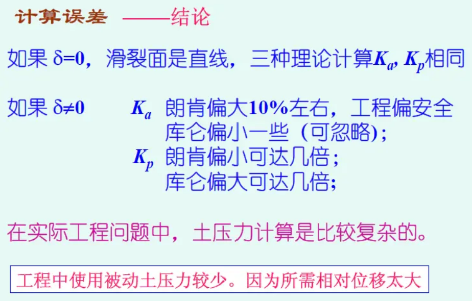

---
## 九  地基承载力
核心要点：地基极限承载力确定方法

==地基承载力==：地基在变形容许和维系稳定的前提下，单位面积上所能承担荷载的能力，单位kPa
- **地基极限状态**
  - ==正常使用极限状态==：荷载增大->地基变形增大->部分区域的应力达到土的抗剪强度->土中应力重分布->地基产生正常使用不能允许的变形。——以变形过大为特征，又称==变形极限状态==；
  - ==承载能力极限状态==: 荷载增大->地基变形增大->部分区域的应力达到土的抗剪强度->土中应力重分布->地基中达到抗剪强度的区域连成一片，地基失去稳定性。——以强度破坏为特征，又称==强度极限状态==。

==地基极限承载力==：
产生==强度极限状态时==作用在地基上的荷载，是基底压力的极限值，指使地基发生剪切破坏失去整体稳定时的基础最小底面压力。广义上的地基极限承载力指的是使地基产生极限状态时基底压力最小值。

- **地基三种破坏形式**
  - **整体剪切破坏**：地基在荷载作用下产生近似线弹性（P-S曲线呈线性）变形。P-S曲线具有明显的转折点，破坏前建筑物一般不会发生过大的沉降，是一种典型的==土体强度破坏==。
  - **局部剪切破坏**：描述这种破坏型式的P-S曲线一般没有明显的转折点，其直线段范围较小，以==变形为主要特征==。
  - **冲切剪切破坏**：不出现明显的破坏区和滑动面，基础没有明显的倾斜，其P-S曲线没有转折点，是==以变形为特征==的破坏型式。

 

- **地基变形三阶段**
  - **压密阶段**
  - **局部剪切阶段**
  - **整体剪切破坏阶段**
***
**临塑荷载**：又称比例极限荷载，指基础边缘地基中刚开始出现塑性极限平衡区时基底单位面积上所承担的荷载，是压密变形阶段的终点，塑性变形阶段的起点荷载。此时地基中任一点都未达到塑性状态，但即将达到。
$$P_{cr}=N_d\cdot\gamma_0 D+N_c\cdot c$$
承载力系数可查表得。临塑荷载由两部分组成，第一部分为基础埋深的影响，第二部分为地基土粘聚力的作用，这两部分都是内摩擦角的函数，随c、φ、D 的增大而增大。

**塑性荷载**：允许地基产生一定范围塑性区所对应的基础荷载;控制塑性区最大开展深度为 $z_{max}=\frac{1}{4}b \;\;\; or \;\;\;\frac{1}{3}b$
$$P_{\frac{1}{4}}=N_{b(\frac{1}{4})}\cdot\gamma b+N_d\cdot\gamma_0 D+N_c\cdot c$$
$$P_{\frac{1}{3}}=N_{b(\frac{1}{3})}\cdot\gamma b+N_d\cdot\gamma_0 D+N_c\cdot c$$
$\gamma$ ——持力层土重度
 $\gamma_0$ ——基础埋深范围土重度
 $z$ ——M点距基底距离

***
**普朗德尔-瑞斯纳地基极限承载力**
$$p_u=cN_c+qN_q$$
- 假定：
  - 1 基底以下土重度＝0
  - 2 基底完全光滑
  - 3 埋深 d < B（底宽）

**太沙基 (Terzaghi) 极限承载力理论**
$$P_u=\frac{1}{2}\gamma B\cdot N_\gamma+q\cdot N_q+c\cdot N_c$$
- 基本条件：
  - 1 考虑基底以下土的自重， 重度不为0；
  - 2 基底完全粗糙；
  - 3 忽略基底以上土体本身的阻力，简化为上覆均布荷载 $q= \gamma_0d$；
  - 4 在极限荷载作用下地基发生整体剪切破坏；

对局部剪切破坏，==抗剪强度指标折减为原先的2/3==

---
## 十  土坡稳定分析
核心要点：瑞典圆弧法＆条分法

**安全系数**
$$F_s=\frac{\tau_f}{\tau_d}$$
$\tau_f$ ——土的平均抗剪强度
 $\tau_d$ ——潜在破裂面上土的平均剪应力
 安全系数为 1 时土坡处于极限（临界）破坏状态

***
**无限土坡稳定分析**

**无渗透水流时**
$$F_s=\frac{c'}{\gamma H\cos^2\beta\tan\beta}+\frac{\tan\phi'}{\tan\beta}$$
对于无黏性土 $c'=0$ ，安全系与高度无关。对于黏性土坡令安全系数为 1 ，则可求得极限平衡状态下的滑动面深度

**有渗透水流时**
$$F_s=\frac{c'}{\gamma_{sat} H\cos^2\beta\tan\beta}+\frac{\gamma'}{\gamma_{sat}}\frac{\tan\phi'}{\tan\beta}$$

***
**整体圆弧法（Mass procedure）**
此法将滑动面以上的土体看成一个整体。当假定组成土坡的土为均质土时，这个方法是很有用的，尽管大多数的天然土坡并不是均质土。

**条分法（Method of slices）**
此法将滑动面以上的土体划分成若干竖直的平行土条。每个土条的稳定性分开计算。这是一个通用方法，可以考虑土的不均匀性和孔隙水压力，也能够反映潜在破坏面上正应力的变化。==p-2次超静定问题==
- 简化条分法：
  - 1）不考虑土条间作用力或仅考虑其中一个---瑞典条分法（又称费伦纽斯法）和简化毕肖甫法；
  - 2）假定条间力的作用方向---折线滑动面分析方法；
  - 3）假定土条间力的作用位置---简布法

**瑞典条分法（费伦纽斯条分法）** 假定各土条两侧分界面上作用力的合力大小相等、方向相反，且作用线重合，即不计条间相互作用力对平衡条件的影响，又称为瑞典条分法。
 只满足滑动土体==整体力矩平衡条件==而不满足土条的静力平衡条件，计算得到的安全系数偏低（即偏于安全）。

**毕肖普法的特点**
 1）满足整体力矩平衡条件；
 2）满足各土条力的多边形闭合条件，但不满足土条的力矩平衡条件；
 3）假设土条间作用力只有法向力没有切向力；
 4）满足极限平衡条件。由于考虑了土条间水平力的作用，得到的安全系数较瑞典条分法高。
 5）与严格的极限平衡分析法结果甚为接近，稳定安全系数的误差不超过7%，大多数情况下在2%左右，且偏于安全。由于计算不很复杂，精度又较高，所以是目前工程中很常用的一种方法。

---
